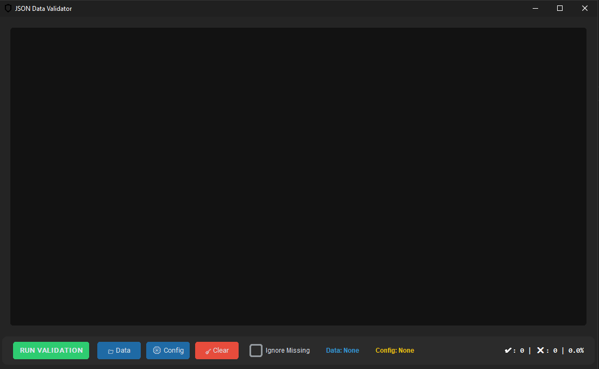
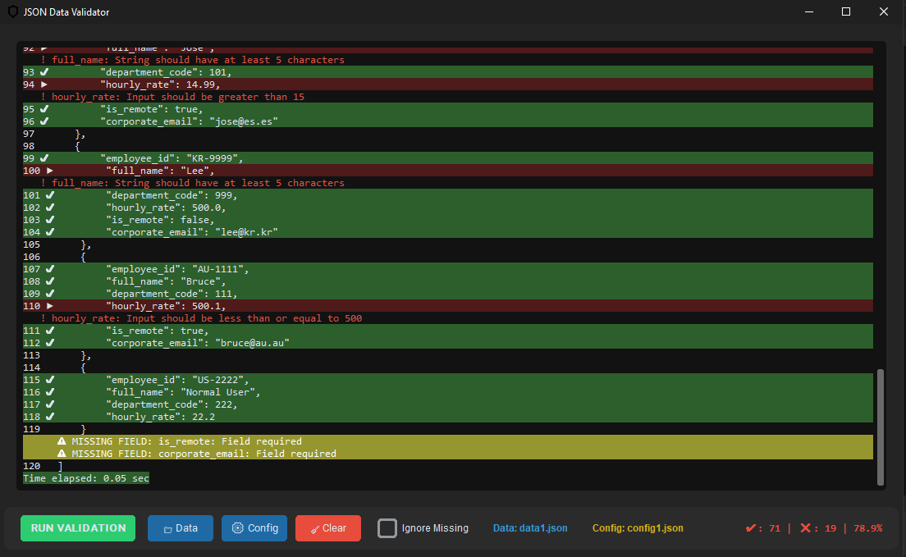

# 📃 Dynamic JSON Validator


**Dynamic JSON Validator** is a high-performance desktop tool designed to kill the pain of manual JSON auditing. It generates Pydantic models on the fly based on your config and rips through datasets to find every single broken comma, wrong type, or missing field.

---

### 🚀 Core Features

* **On-the-Fly Validation**: No hardcoded models. Define your rules in a JSON config, and the app builds the validation logic instantly.
* **Visual Debugging**: Errors are highlighted directly in the code view. 
    * 🔴 **Red** for data mismatches (wrong types, regex fails).
    * 🟡 **Yellow** for missing fields.
* **Auto-Format (Prettify)**: Throw in a messy one-line JSON "sausage", and the app will automatically expand it into a clean, readable structure.
* **Smart "Ignore Missing" Toggle**: Need to skip optional field warnings? Just flip the switch.
* **Deep Logic Support**:
    * **Regex Patterns**: Validate IDs, serials, and custom strings.
    * **Numerical Ranges**: Check for `>` , `<` , or `==`.
    * **Email Verification**: Built-in logic for corporate or personal emails.

### 🎮 GUI Preview

| Interface & Analytics | Error Highlighting |
| :---: | :---: |
|  |  |

*You can find sample data and config files in the `example/` folder to test the application.*

### 🛠 Tech Stack
* **Python 3.10+**: The core engine.
* **Pydantic V2**: Ultra-fast data validation and type enforcement.
* **CustomTkinter**: Modern, dark-themed UI that won't make your eyes bleed at 3 AM.

---

### 🔩 Installation & Usage

1.  **Clone the repository:**
    ```bash
    git clone https://github.com/nzr-xdev/json_dict_validator.git
    cd json_dict_validator
    ```

2.  **Install dependencies:**
    ```bash
    pip install -r requirements.txt
    ```

3.  **Launch the App:**
    ```bash
    python main.py
    ```

---

### 📖 How it works:
1.  **Load Data**: Select your target JSON file.
2.  **Load Config**: Select the rules file (defining types, ranges, etc.).
3.  **Run Validation**: Hit the button and watch the magic happen.
4.  **Audit**: Review the highlighted errors and check the auto-generated JSON report for further processing.